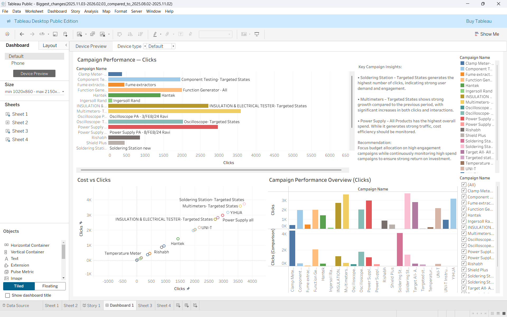
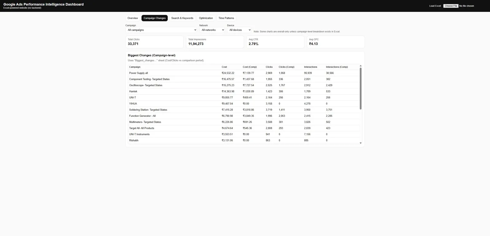

# Google Ads Performance Intelligence Dashboard

A fully interactive, Excel-powered analytics dashboard built from scratch 
using HTML, JavaScript and Chart.js — no backend, no framework.

## Live Demo

[Open Dashboard](https://alurivijaysagar.github.io/google-ads-performance-dashboard)

> A sample dataset is included — the dashboard loads automatically with demo data.

## Web Dashboard Preview

## Tableau Dashboards

Built complementary Tableau dashboards for deeper visual analysis.

> Tableau workbook files (`.twbx`) are included in this repository.  
> To open them, download [Tableau Public Desktop](https://public.tableau.com/en-us/s/download) (free).

## What This Dashboard Does

Analyses 90 days of real Google Ads campaign data across 5 analytical views:

| Tab | What it shows |
|-----|---------------|
| Overview | KPIs, impressions trend, clicks trend, network & device performance |
| Campaign Changes | Cost and clicks vs comparison period across all campaigns |
| Search & Keywords | Top keywords and search terms by clicks, impressions and cost |
| Optimization | Optimization score by campaign |
| Time Patterns | Impressions by day, hour, and day×hour heatmap |

## Key Metrics Analysed

- Total Clicks: 33,371
- Total Impressions: 11,94,273
- Avg CTR: 2.79%
- Avg CPC: ₹4.13

## Tech Stack

- HTML5 & CSS3
- JavaScript (vanilla)
- Chart.js — interactive charts
- SheetJS (XLSX) — Excel file parsing in browser
- No backend, no server, no framework

## How to Use

1. Open the live dashboard link above — sample data loads automatically
2. Or click "Choose File" to upload your own Google Ads Excel export

## Author

A.V.M. Vijay Sagar  
B.Tech CSE — KL University Hyderabad  
[LinkedIn](https://www.linkedin.com/in/aluri-vijay-sagar-75a5342b8/)
